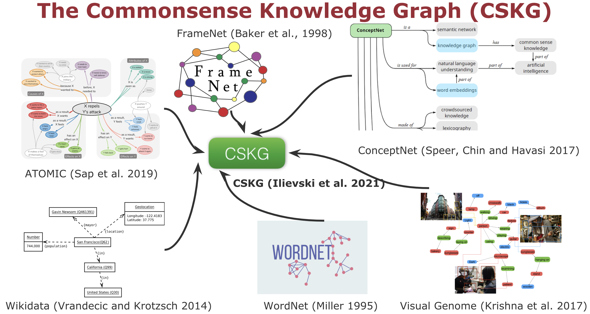

**Figure 1**: Overview of the sources included in CSKG.

CSKG is a commonsense knowledge graph that combines seven popular sources into a consolidated representation: [ATOMIC](https://homes.cs.washington.edu/~msap/atomic/), [ConceptNet](http://conceptnet.io/), [FrameNet](https://framenet.icsi.berkeley.edu/fndrupal/), [Roget](http://www.roget.org/), [Visual Genome](http://visualgenome.org/), [Wikidata](http://wikidata.org/) (We use the [Wikidata-CS](https://zenodo.org/record/3983030#.YEkr45NKimk) subset), and [WordNet](https://wordnet.princeton.edu/). CSKG is represented as a hyper-relational graph, by using the  KGTK [data model](https://kgtk.readthedocs.io/en/latest/data_model/) and [file specification](https://kgtk.readthedocs.io/en/latest/specification/). Its [creation](https://github.com/usc-isi-i2/cskg/blob/master/consolidation/create_cskg.sh) is entirely supported by KGTK operations. 


## Data

CSKG can be downloaded from [here](https://doi.org/10.5281/zenodo.4331372). 

Different graph and text embeddings of CSKG can be found [here](https://drive.google.com/drive/u/1/folders/16347KHSloJJZIbgC9V5gH7_pRx0CzjPQ).

CSKG is licensed under a
[Creative Commons Attribution-ShareAlike 4.0 International License].


**Figure 2**: Snippet of CSKG. CSKG combines: 1) lexical nodes (`piano`, `keys`, `music`; in blue), 2) synsets like `piano (artifact)`, `seat (dramaturgy)` (in green), and 3) frames (`fn:noise_makers`) and frame elements (`fn:fe:use`) (in purple).


## How to cite
```
@article{ilievski2021cskg,
  title={CSKG: The CommonSense Knowledge Graph},
  author={Ilievski, Filip and Szekely, Pedro and Zhang, Bin},
  journal={Extended Semantic Web Conference (ESWC)},
  year={2021}
}
```
